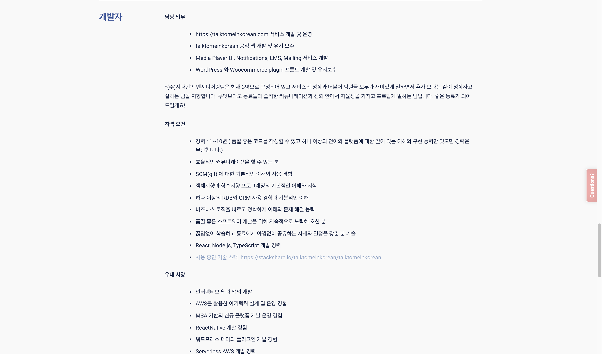

# "Hello There" or "안녕하세요"

If you have found your way here then you're probably wondering what this application/code is or "Why this application/code is (Not to sound too cryptic LOL)"

[Talk To Me In Korean](https://talktomeinkorean.com/) is a very popular (If not most popular) online resource for learning the Korean language, as I myself love the resource but not only that, I'm sure there numbers speak for themselves as far as their popularity, impact and outreach goes

## Before continuing down the "WHAT" of this application, lets dive a little bit into the "WHY"

[Talk To Me In Korean](https://talktomeinkorean.com/) as a great of a resource as it is, has its issues not so much on the teaching side but more so on the technical side, when I say that, I don't mean the site is terrible, as a matter of fact I think it is designed pretty well and the aplication itself functions how it is supposed to but like everything technical out there, including things that I build, it has room for improvement as well

## very noticable technical bugs include
* Very long wait time to get into "My Learning Center" (Perhaps the most noticeable or annoyiing thing)
    * This could be due to a number of reasons, it very well could be geographic location, as they are based in South Korea and I am in the United States
* Long wait times for other pages of the application
* Occasionally Top Nav bar will not function how it is supposed to and redirect the user to unwanted pages or routes
* Cookies will often stay set in my browser regardless of whether or not I am logged in
    * Example: When I am logged out of the application, notifications for my account will still appear in the notifications drop down menu (This is not the case for every device that I own)

These are just a few of the bugs that I have found in the application, again, I am not saying that this is a terrible application, what I am saying is that like every other application out there, it has room for improvement

# SO WHAT, what is this source code?

[Talk To Me In Korean](https://talktomeinkorean.com/) in a very hidden area of their site, has a job posting looking for a software developer, more specifically, A React developer [Job Posting Link](https://talktomeinkorean.com/recruit/)

Now I myself am not really looking for a developer job as I already have one but I would love to help out this site in really any way I can as I've learned so much from TTMIK and would like to give back in some way. TTMIK itself is not built in React or at least it isn't to my knowledge

[TTMIK Stackshare](https://stackshare.io/talktomeinkorean/talktomeinkorean) says that it is built using a number of things like AWS, Heroku, Google Cloud etc. One thing it also includes is React, now pulling up React dev tools in my browser, there is absolutely no trace of React being used anywhere on the site, or who knows, maybe I'm just dumb. One thing I can see is that the site was built using wordpress, you can see that in dev tools sources tab and when trying to upload a profile picture it redirects you to a wordpress application (This could be another bug or user experience note mentioned above).

Another thing to note as well, I mentioned above that one possible reason the learning center takes so long to load is maybe geographic location, here's the thing, if TTMIK really uses AWS EC2 and CloudFront, Geographic location would not be an issue, so looking at TTMIK Stackshare, I overall just get really confused as I don't think that TTMIk is really using all those technologies, now it could be that those technologies are not in the current version of TTMIK and they are right now trying to upscale to those technologies but for right now, at least as far as React goes, they are not using it

# This is a clone of "Talk To Me In Korean" built using React
I will say this as well, this is not a complete clone of TTMIK, a lot of the little features and details were left out for time sake, but the core components and features are present in this React clone.

In my personal opinion, TTMIk can not go wrong by moving to React, React can certainly fix the long loading time by making the site an SPA but also React can really take TTMIK to the next level by improving the user experience and making TTMIK just a much more feature rich application and one that processes data in a much smarter way as well.
